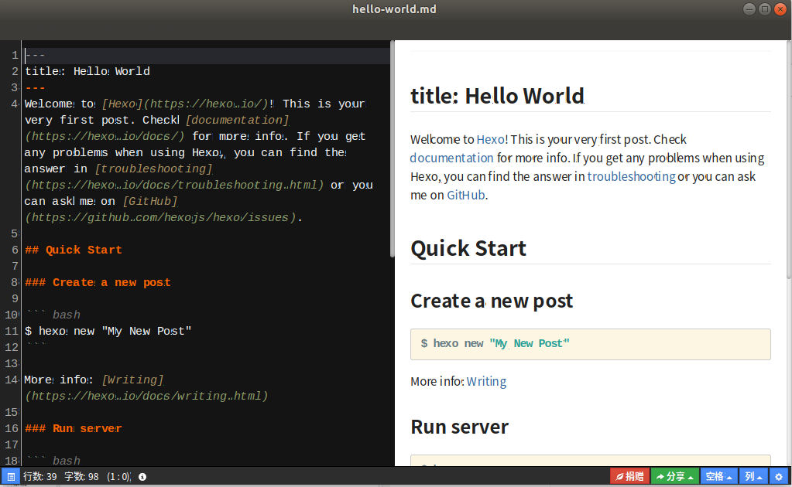

离线markdown编辑器Haroopad是开源、免费、跨平台的，支持windows，linux和mac系统,语法标亮支持 54 种编程语言，主题样式丰富。另外它还支持撰写数学公式，支持一套文本绘图DSL，支持自动生成文档目录等等。Haroopad支持直接将文档发布成PDF格式，也支持用户自定义显示样式。
<!-- more -->

### 标题
一级标题（#）
二级标题（##）
三级标题（###）
### 插入图片

### 表格

|  表头   | 表头  |
|  ----  | ----  |
| 单元格  | 单元格 |
| 单元格  | 单元格 |
### 代码块

```javascript
$(document).ready(function () {
    alert('RUNOOB');
});
```
### 列表
Haroopad支持有序列表和无序列表。
无序可用 * + - 显示都是点

* 第一项
* 第二项
* 第三项

1. 第一项
2. 第二项
3. 第三项


