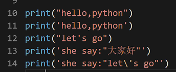
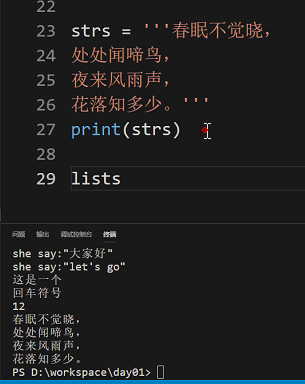
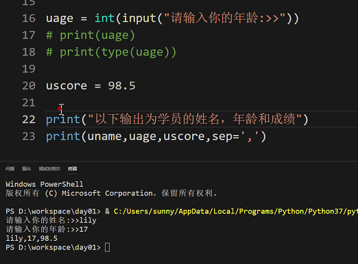
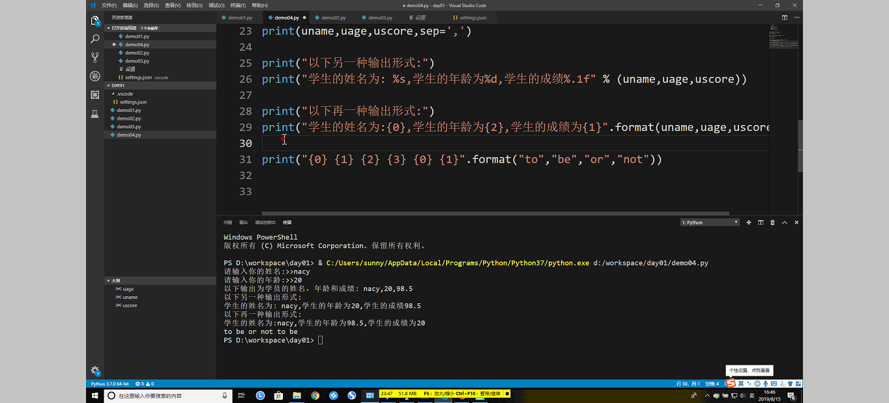
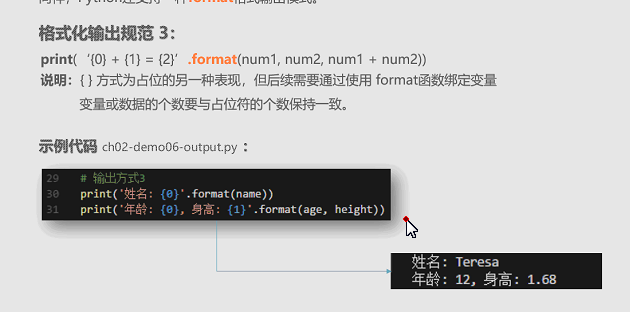

### pip安装最新版本
pip install -U wheel
-U 最新版本
<!-- more -->
### 修改镜像源
[清华大学镜像](https://pypi.tuna.tsinghua.edu.cn/)

C:\Users\zhangbo\AppData\Roaming\pip\pip.ini
### print输出问题
实例
~~~python
print("Let's go")
print("这个\\n是回车")
print('she sys:"let\'s go"')
~~~
以下输出案例
~~~
Let's go
这个\n是回车
she sys:"let's go"
~~~
实例
~~~python
strs =  '''
        白玉谁家郎，回车渡天津。
        看花东陌上，惊动洛阳人。
        '''
print(strs)
~~~

以下输出案例
~~~
白玉谁家郎，回车渡天津。
看花东陌上，惊动洛阳人。
~~~
实例
~~~python
print(value，sep='',end='',file=,flush=False)
~~~
实例
~~~python
age = 12
name = 'ab'
print('年龄:{1},身高:{0}'.format(age,name))
~~~
以下输出实例
~~~
年龄:ab,身高:12
~~~

遇到的问题

[Python中 is 和 == 的区别](https://www.jianshu.com/p/9456d0a4a63d)