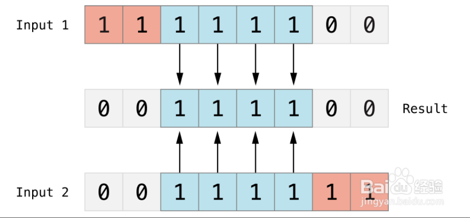

### zip描述
zip() 函数用于将可迭代的对象作为参数，将对象中对应的元素打包成一个个元组，然后返回由这些元组组成的列表。
如果各个迭代器的元素个数不一致，则返回列表长度与最短的对象相同，利用 * 号操作符，可以将元组解压为列表。
<!-- more -->
实例
~~~python
a  = [1,2,3]
b = ["a","b","c"]
dict(zip(a,b))
~~~
输出
~~~
{1: 'a', 2: 'b', 3: 'c'}
~~~
算数运算符
~~~
5//2
2

10%3
 1
10%-3
-2
-10%-3
-1
~~~
### 运算符的优先级
|运算符	|描述|
|----|----|
|**指数	|(最高优先级)|
|~ + -	|按位翻转, 正负号|
|* / % //	|乘，除，取模和取整除|
|+ -	|加法减法|
|>> <<	|右移，左移运算符|
|&	|位 ‘AND’|
|^	|位运算符|
|<= < > >=	|比较运算符|
|== !=	|等于运算符|
|= %= /= //= -= += = *=	|赋值运算符|
|is is not	|身份运算符|
|in not in	|成员运算符|
|not or and	|逻辑运算符|
指定
~~~
A = 60（0011 1100）; B = 13 （0000 1101）
~~~
按位与（&）

按位或（|）

按位异或（^）

按位取反（~）

按位左移（<<）

按位右移（<<）

迭代器有两个基本的方法：iter() 和 next()。
练习：字典城市
~~~python
citys = {
"陕西省": ["西安", "咸阳"],
"福建省": ["厦门", "福州"]
}
# for i, j in citys.items():
#     print(i)
#     for x in j:
#         print("|-{}".format(x))
prame = iter(citys.keys())
while True:
try:
    tun = next(prame)
    it = iter(citys[tun])
    print(tun)
    while True:
        try:
            print("|-{}".format(next(it)))
        except StopIteration:
            break
except StopIteration:
    print("~结束~")
    exit()
~~~
循环语句可以有 else 子句，它在穷尽列表(以for循环)或条件变为 false (以while循环)导致循环终止时被执行,但循环被break终止时不执行。

如下实例用于查询质数的循环例子:
~~~python
for n in range(2, 10):
    for x in range(2, n):
        if n % x == 0:
            print(n, '等于', x, '*', n//x)
            break
    else:
        # 循环中没有找到元素
        print(n, ' 是质数')
~~~
输出
~~~
2  是质数
3  是质数
4 等于 2 * 2
5  是质数
6 等于 2 * 3
7  是质数
8 等于 2 * 4
9 等于 3 * 3
~~~
字典推导式：
~~~python
dit = {"a":2}
cit = {v:k for k,v in dit.items()}
~~~
输出：
~~~
{2: ‘a’}
~~~